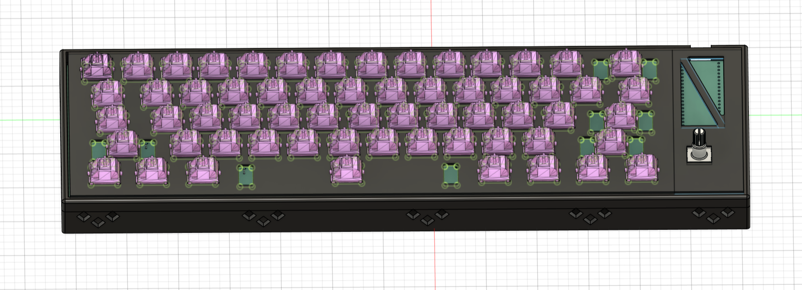
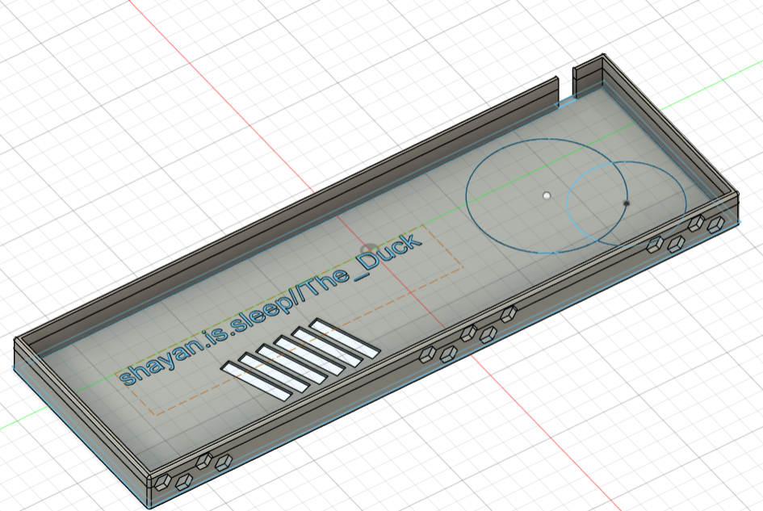
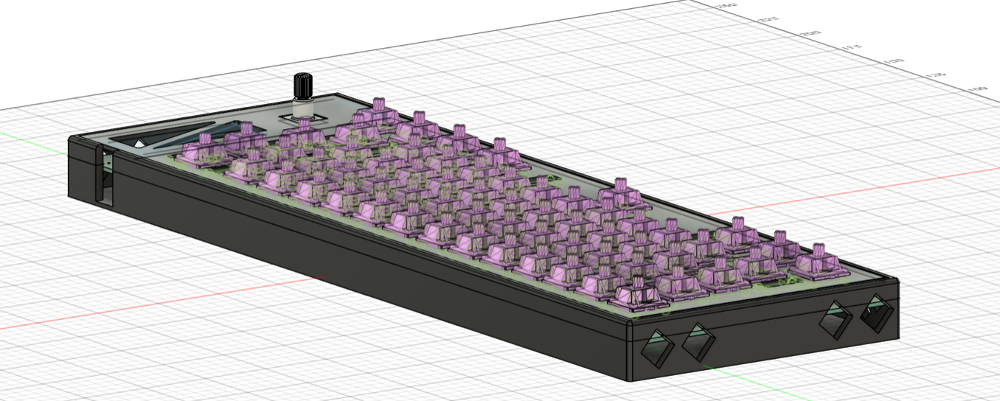
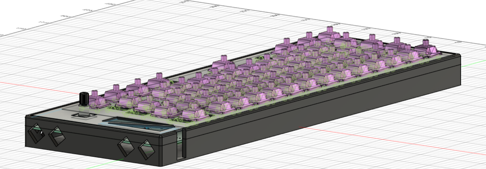
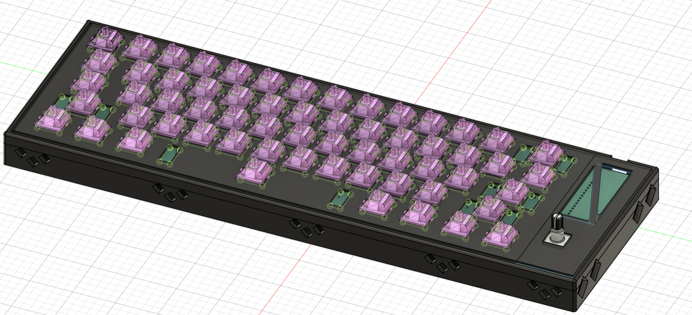

# Nap-Pad

A 60% keyboard with RGB and a rotary encoder. Made for sleepers, by sleepers. It is portable and very relaxing. Made with KiCAD and Fusion 360 and by Shayaan.is.sleep//The_Duck🦆 (me) I designed this to be very minimal and to adhere to a specific color scheme. I have a black with blue accents computer and a white desk, so I want the case and keycaps to reflect that. This keyboard is an extension project for my hackpad, which I have built at the time of writing. This would just be the normal, default 60% keyboards you find at your local Best Buy. (look in Assets folder for pdf of schematic)

## Motavation
I wanted to add more features that I missed out on in my hackpad. One thing I really wanted was an ACC matrix in my schematic. This would allow me to not be constricted by the number of GPIO pins on my chip. I did not want to make a full 104-key keyboard because I thought it would be too much of a jump from a 6-key keypad to a full-size one.

## Photos

## BOM

| Item  | Quantity | cost | notes | link |
| ------------- | ------------- | ------------- | ------------- | ------------- |
| PCB  |  |  32.63 | includes shipping and duties  |  JLCPCB |
| Rotery encoder  |  | 0  | Already owned  |  N/A |
|  switches |  | 39.60  | Kailh white Box Switch v2  | (https://www.amazon.ca/DRAOZA-Mechanical-Keyboard-Waterproof-Dustproof/dp/B0B9BDM57S/ref=sr_1_1?dib=eyJ2IjoiMSJ9.m46gAJky6mvveBdoPM6G0Bqff3t3H-JlgALWFqsYkIzK6f2OjZi30Oqz8CpCR5Ha2FFKmAjoot_OlK31yNlAk_f_K5Uej1uoJ7yzFg2GPCvaAgBfqdJtB9Hp7fzP0INWc6BwC4DnzXwxmzEg411zNKiwnuXnSy-I4T__J7t1EELOR0YZHLRP9n7w3H8bv_dMlrUZwWq0KA-z7J7asj08Q3OI16xCmB2bi29se8Z0EmcR-tu2PRx939jgWnd-GLku6Gw-Yn6LqZ5AD-_G9801sg12d_Rio1tt5Ozvn9Hftco.Jt98DYzyQJYuVERCqe-ktBRGhfifDhUicgHSDXzDvt8&dib_tag=se&keywords=box%2Bwhite%2Bv2%2Bkailh%2Bmx%2Bswitches&qid=1753852675&sr=8-1&th=1)  |
| Diodes  |  | 0  | Already owned  | N/A  |
|  leds |  | 13.99  |  SK6812mini-e |  https://www.aliexpress.com/i/4000476037223.html |
| keycaps  |  |  44.18 | shipping included  |  https://www.amazon.ca/Doubleshot-Keyboard-Switches-Mechanical-Keyboards/dp/B0BNWWVXQ2/?_encoding=UTF8&pd_rd_w=9ngKH&content-id=amzn1.sym.1eddeb24-49ac-4f63-adba-476f139ed9d3%3Aamzn1.symc.a68f4ca3-28dc-4388-a2cf-24672c480d8f&pf_rd_p=1eddeb24-49ac-4f63-adba-476f139ed9d3&pf_rd_r=SZ89S6H40RGR9BQMAZ2N&pd_rd_wg=dmQc3&pd_rd_r=39e621e9-7adb-43c3-bd0f-eada45d6220c&ref_=pd_hp_d_atf_ci_mcx_mr_ca_hp_atf_d&th=1 |
|  Stabilizers |  | 7.99  |   |  https://www.aliexpress.com/item/1005009141481219.html |
|  Chip |  | 0  | already owned (pico)  |  N/A |
| capacitors | 6 | 1.38 | 100nf THT | https://www.aliexpress.com/item/1005002290441861.html?spm=a2g0o.productlist.main.4.42caA1wVA1wVh4&aem_p4p_detail=202508032051198858958194839320007140543&algo_pvid=49f9f44b-662c-49ed-9877-fc4a33ca1e9c&algo_exp_id=49f9f44b-662c-49ed-9877-fc4a33ca1e9c-3&pdp_ext_f=%7B%22order%22%3A%22656%22%2C%22eval%22%3A%221%22%7D&pdp_npi=4%40dis%21CAD%211.38%211.38%21%21%210.98%210.98%21%402101ec1a17542794798883804e054c%2112000020462004307%21sea%21CA%216437165644%21X&curPageLogUid=kATS2oS2DdSY&utparam-url=scene%3Asearch%7Cquery_from%3A&search_p4p_id=202508032051198858958194839320007140543_1#nav-specification |
| Shipping | N/A | 21.74 | Ali+amazon order |N/A |

| Total (CAD)  |
| ------------- |
| $ 168.93 |

