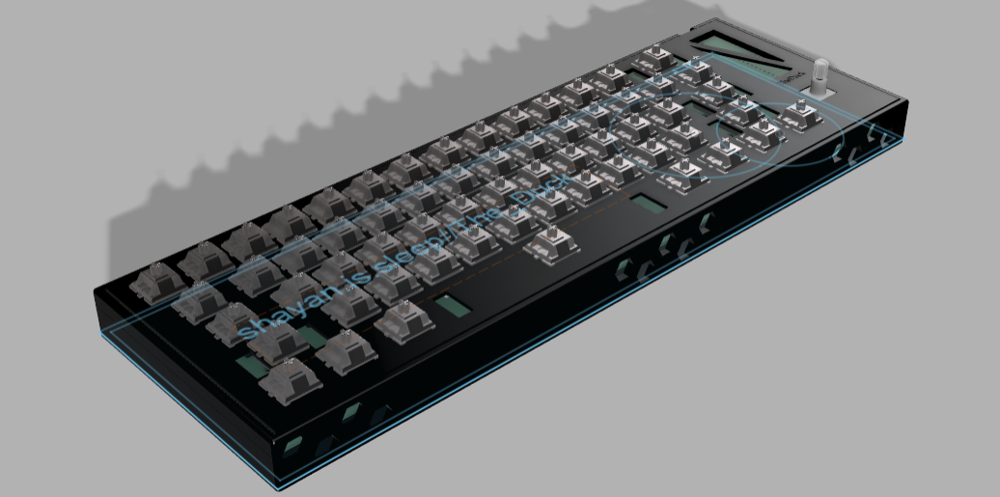

# Nap-Pad

A 60% keyboard with RGB and a rotary encoder. Made for sleepers, by sleepers. It is portable and very relaxing. Made with KiCAD and Fusion 360 and by Shayaan.is.sleep//The_Duck🦆 (me) I designed this to be very minimal and to adhere to a specific color scheme. I have a black with blue accents computer and a white desk, so I want the case and keycaps to reflect that. This keyboard is an extension project for my hackpad, which I have built at the time of writing. This would just be the normal, default 60% keyboards you find at your local Best Buy. (look in Assets folder for pdf of schematic)

## Motavation
I wanted to add more features that I missed out on in my hackpad. One thing I really wanted was an acc matrix in my schematic. This would allow me to not be constricted by the number of GPIO pins on my chip. I did not want to make a full 104-key keyboard because I thought it would be too much of a jump from a 6-key keypad to a full-size one. Also tyy for The Weekend for Six Feet Under, underrated song ong.

## Photos

## BOM

| Item  | Quantity | cost | notes | link |
| ------------- | ------------- | ------------- | ------------- | ------------- |
| PCB  |  |  32.63 | includes shipping and duties  |  JLCPCB |
| Rotery encoder  | 1x | 2.99  |   |  https://www.aliexpress.com/item/1005005983134515.html?spm=a2g0o.productlist.main.1.24db5f38Y1lF15&algo_pvid=af9aa107-7215-428e-b720-f4a0342078d5&algo_exp_id=af9aa107-7215-428e-b720-f4a0342078d5-0&pdp_ext_f=%7B%22order%22%3A%222212%22%2C%22eval%22%3A%221%22%7D&pdp_npi=6%40dis%21CAD%212.59%212.59%21%21%211.84%211.84%21%402103209b17545067419911153e19c9%2112000035172713580%21sea%21CA%216437165644%21X%211%210%21&curPageLogUid=k4jL3GPoTav5&utparam-url=scene%3Asearch%7Cquery_from%3A |
|  switches | 61x | 30.35  | Kailh white Box Switch v2  |  https://www.aliexpress.com/item/1005008723788969.html?spm=a2g0o.productlist.0.0.7fb15661ATNCvm&mp=1&pdp_npi=5%40dis%21CAD%21CAD%2036.39%21CAD%2030.35%21%21CAD%2030.35%21%21%21%402103201917545041377485752e4ead%2112000046402747119%21ct%21CA%216437165644%21%211%210 |
| Diodes  |  | 10.30  |  | https://www.amazon.ca/dp/B0CP9LXW6J |
|  leds |  | 13.99  |  SK6812mini-e |  https://www.aliexpress.com/i/4000476037223.html |
| keycaps  | 1 set |  39.99 | shipping included  |  https://www.amazon.ca/Doubleshot-Keyboard-Switches-Mechanical-Keyboards/dp/B0BNWWVXQ2/?_encoding=UTF8&pd_rd_w=9ngKH&content-id=amzn1.sym.1eddeb24-49ac-4f63-adba-476f139ed9d3%3Aamzn1.symc.a68f4ca3-28dc-4388-a2cf-24672c480d8f&pf_rd_p=1eddeb24-49ac-4f63-adba-476f139ed9d3&pf_rd_r=SZ89S6H40RGR9BQMAZ2N&pd_rd_wg=dmQc3&pd_rd_r=39e621e9-7adb-43c3-bd0f-eada45d6220c&ref_=pd_hp_d_atf_ci_mcx_mr_ca_hp_atf_d&th=1 |
|  Stabilizers |  | 7.99  |   |  https://www.aliexpress.com/item/1005009141481219.html |
|  Chip | 1x | 18.99 |   | https://www.amazon.ca/dp/B0CDLDTV19 |
| capacitors | 6 | 1.38 | 100nf THT | https://www.aliexpress.com/item/1005002290441861.html?spm=a2g0o.productlist.main.4.42caA1wVA1wVh4&aem_p4p_detail=202508032051198858958194839320007140543&algo_pvid=49f9f44b-662c-49ed-9877-fc4a33ca1e9c&algo_exp_id=49f9f44b-662c-49ed-9877-fc4a33ca1e9c-3&pdp_ext_f=%7B%22order%22%3A%22656%22%2C%22eval%22%3A%221%22%7D&pdp_npi=4%40dis%21CAD%211.38%211.38%21%21%210.98%210.98%21%402101ec1a17542794798883804e054c%2112000020462004307%21sea%21CA%216437165644%21X&curPageLogUid=kATS2oS2DdSY&utparam-url=scene%3Asearch%7Cquery_from%3A&search_p4p_id=202508032051198858958194839320007140543_1#nav-specification |
| Shipping | N/A | 10.99 | Ali+amazon order |N/A |
| Kalih hotswap | 1 set | 12.40 |  | https://www.aliexpress.com/item/1005002653433091.html?spm=a2g0o.productlist.main.5.46b155f9DP4pJx&algo_pvid=ba556ca0-b9d5-448c-9c78-f40e4db617a3&algo_exp_id=ba556ca0-b9d5-448c-9c78-f40e4db617a3-4&pdp_ext_f=%7B%22order%22%3A%22-1%22%2C%22eval%22%3A%221%22%7D&pdp_npi=6%40dis%21CAD%2116.35%218.99%21%21%2183.42%2145.87%21%402101d9ef17545057580813612e0d0c%2112000021573005278%21sea%21CA%216437165644%21X%211%210%21&curPageLogUid=3lRsJQuxtd84&utparam-url=scene%3Asearch%7Cquery_from%3A#nav-specification |
| USB c to a cable | 1x | 12.78 |  | https://www.aliexpress.com/item/1005007994819567.html?spm=a2g0o.productlist.main.7.4ff33fcb1nHz8P&algo_pvid=74f753d9-f52d-49d0-891c-71802c7aca80&algo_exp_id=74f753d9-f52d-49d0-891c-71802c7aca80-6&pdp_ext_f=%7B%22order%22%3A%2267%22%2C%22eval%22%3A%221%22%7D&pdp_npi=6%40dis%21CAD%2112.48%2112.48%21%21%2163.67%2163.67%21%402101ec1f17544508490103968e3ff6%2112000043194746134%21sea%21CA%216437165644%21X%211%210%21&curPageLogUid=OkDO6QcIinjE&utparam-url=scene%3Asearch%7Cquery_from%3A |
| rubber pads | 1 set | 3.99 | bought from local shops | Dolleramma |

| Total (CAD)  | Total (USD) |
| ------------- | ------------- |
| $ 199.27 | $ 144.98 |