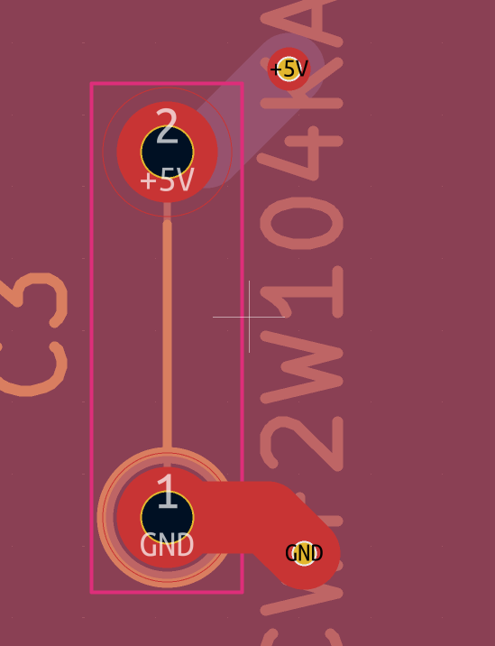

# **Nap-Pad 🛌**
a 60% keyboard with rgb and a rotery encoder. Made for sleepers, by sleepers. It is portable, and very sleepy. Made with KiCAD and Fusion 360 and by Shayaan.is.sleep//The_Duck🦆 (me)  Total Hours: 14

## Day 1 - june 11 10:00 pm
So the plan is to start the full-size project today, and then I'll try to finish this by the weekend. I did the HackPad, so I do have some experience behind my belt, but I never used materials or an OLED screen, so I'm a bit worried about that. What I plan to do is that I'll have around 61 keys all connected into a grid and that into the pico. I'll also have a rotary encoder and an SM RGB. I'll scrap the RGB if I run out of time.
- Started making the grid for the switches and started to plan out my pins for the Pico
Finished the keys, but they are too big. I'm looking at other submissions, but my grid thing—I have my keys in it—is way too big. They like to take up more than half the sheet, so I have to go find a solution for that. But overall it was a nice productive 2 hours.

## Day 2 - June 15 5:00am
So I kinda procrastinated too much, and I didn't do it for like 3 days. It's really early in the morning, and I just finished the RGBs. I was going to do it so each switch will have its own LED, but to save cost, I'll have 10-20 LEDs around the board and transparent keycaps to make some sort of backlight. I looked at some guides to understand how to wire them, and yeah. 

## Day 3 - June 20 3:00 pm
So sorry for the long break; I had to finish school. I still have 1 final left(chem). So today I'm going to work on the wiring of the tags to the chipset for the schematic and try to start on the wiring of the PCB. So I finished the schematic, but I had to solve this weird problem. Firstly, the LED I was using was really bad and was too big for my build (WBS1821), so I had to switch over to SK6812-MINI-E. There was no footprint for SK6812-MINI-E, so I had to make my own. This took quite some time, as I needed to orient that correctly (like DIN to pin 4, DOUT to pin 2, VDD to pin 1, and VSS to pin 3). I have also finished wiring everything in the schematic. So the next step is to do the PBC and CAD files, and I want to try to add a touchpador add the full amount of the switches.

## Day 4 - July 28 2:00 pm
Ok,, so tbh after finishing the schematic, II got really confused with the footprints, so I kinda rage quit and started to work on my other projects until a few days ago, II had the urge to finishh all my projects,, as I hadbeen told that the ending date for submissions is July 31. I finished the footprint issue after I asked a friend I have on Slack. He told me I needed to use Khali MX SW. So after downloading and finding them, I finished all that. I even got to place all my switches and diodes and LEDs. Overall, around 2 hours was used for this entery.

## Day 5 - July 29 9:00 am
Ok, so I want to be done with everything today, so I started wiring everything. My friend (the same one that told me about the footprints) gave me advice on how and why I should set a ground pour. This is basically a big block that will all be grounded or 5 volts. This will hopefully lessen the amount of wires. After I finished all that, I thought I was done, but it turns out the ground pour could be cut off, and I had like 20 huge holes in my ground pour. I spent the next 3 hours connecting and moving wires so everything gets connected. After so long, at 10:30 pm, I have finished the whole thing and even ran the DRC, and everything went good! I even got the time to clean up my schematic. This took so long so i was at my desk for like the whole day. Like im not lying ts acc took like so long. It took around like 3-4 hours to get the ground pour to set up and to finish the wires. (thank god for youtube tutorials)

## Day 5, Part 2: 3:00 am

So after I took a break after I finished the PCB, I started to move on to the Fusion 360 3D modeling for the case. This was relatively easy, as I have done the same for my hackpad, and I just used the same tutorial. Some of the numbers will be wrong if you follow the guide, but the pictures show you where they got the numbers, so yeah, 10/10 job to whoever made it. As of now I have just finished the top and bottom plate and made a little assembly file to render how it would look at the end and to make sure everything matches up. This was rly short bc tbh it was rly easy so it took me like an hour or so.

## day 6 - Aug 3 2:19 am

I got some feedback on a few things so i was working for around a hour on all of it. I was asked to imporve my case, so i did that. I added a cool cover over the pico and a hole for the encoder. I even added the electrical components (switches, ec11). 

## Day 7 - Aug 3  11:34 pm
Ok so this is somewhat cool. I also got a review to add decoupling caps on my leds, as they can minimize noise. So i had to find a new thing to add to my libary so i added that. I got a 100nf THT cap. So around 16 led ill add this. So i read that it does not matter what goes in each pin. So 5v can go in pin 1 or pin 2, becuse it is not polerized. So what im acc doing is im using a footprint of a risistor, bc the cap footprint size is liek 1cm for sm resoion so im trying to set it down to 5 mm. For the PCB, I have just added the 2 pins to 5v and to GND using the ground pour and the thicc wire. I even added some colour to the case in the images. (1mm).    

